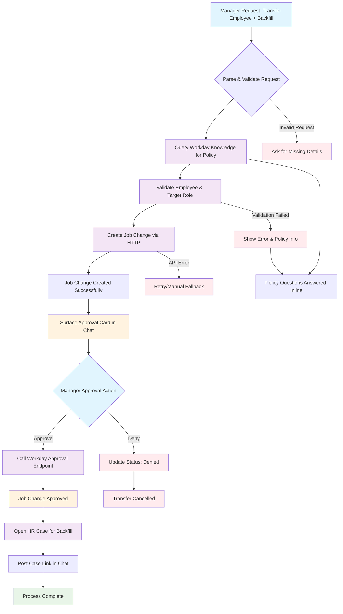

# Usecase: "Transfer Priya Nair to Senior Data Engineer in Analytics on Nov 1 and open a backfill."
The Copilot validates details against Workday, creates the Job Change, surfaces and actions the Workday inbox approval in chat, then opens an HR Case to track the backfill and shares policy answers inline from Workday Knowledge. This hits three Workday connectors plus an HTTP call for any gap endpoints.

Video: https://www.youtube.com/watch?v=tIBP6rMB2G4
## Flow Diagram

## Connectors you will usease - Internal Transfer + Backfill Copilot in chat

A manager types:
“Transfer Priya Nair to Senior Data Engineer in Analytics on Nov 1 and open a backfill.”
The Copilot validates details against Workday, creates the Job Change, surfaces and actions the Workday inbox approval in chat, then opens an HR Case to track the backfill and shares policy answers inline from Workday Knowledge. This hits three Workday connectors plus an HTTP call for any gap endpoints.

## Connectors you will use

* **Workday Knowledge** - enterprise search answers for transfer policy, eligibility rules, and forms in chat. ([Moveworks][1])
* **Workday Approvals** - show the Workday inbox approval in chat and let approvers approve or deny directly. ([Moveworks][2])
* **Workday HR Cases** - open and track a backfill or comp-change case when the transfer is approved. ([Moveworks][3])
* **HTTP connector to Workday** - call specific REST or RaaS endpoints to create the Job Change and, if allowed in your tenant, create a Job Requisition. ([Moveworks][4])
* Reference - Moveworks’ Workday integration overview for automation scope across HR and finance. ([Moveworks][5])

## Connection order - fastest path to a demo

1. **Workday Knowledge** - immediate value and a quick health check that search works and auth is correct. ([Moveworks][1])
2. **Workday Approvals** - unlocks the in-chat approval moment that sells the story. Ensure the ISU security group and business process steps are configured for approvals. ([Moveworks][6])
3. **HTTP connector to Workday** - implement Create Job Change and fetch job profiles for validation. If requisition creation is permitted in your tenant, add that call. ([Moveworks][4])
4. **Workday HR Cases** - open a “Backfill requisition tracking” or “Comp review” case post-approval so you can show lifecycle status. ([Moveworks][3])

## What the MVP does in chat

* Confirms worker, target org and job profile, effective date, and whether to open a backfill.
* Calls Workday to create the **Job Change** and returns the business process and inbox task id.
* Surfaces the **Approval** card in chat and handles Approve or Deny. ([Moveworks][2])
* If approved, opens a **Workday HR Case** to track the backfill and posts the case link. ([Moveworks][3])
* Answers “What is our internal transfer policy” or “Which orgs can I transfer into” by querying **Workday Knowledge**. ([Moveworks][1])

---

* **Create Job Change** - via HTTP connector to your Workday REST endpoint.
  `workerId, jobChangeReasonId, effectiveDate, supervisoryOrgId, jobProfileId, locationId, comments` - keep fields minimal for the demo. ([Moveworks][4])
* **Approve inbox task** - call the Workday approval action with `inboxTaskId` and `action=APPROVE`. ([Moveworks][2])
* **Open HR Case** - submit a case with summary, workerId, prior position, and target org so HR can post the requisition and coordinate comp. ([Moveworks][3])

